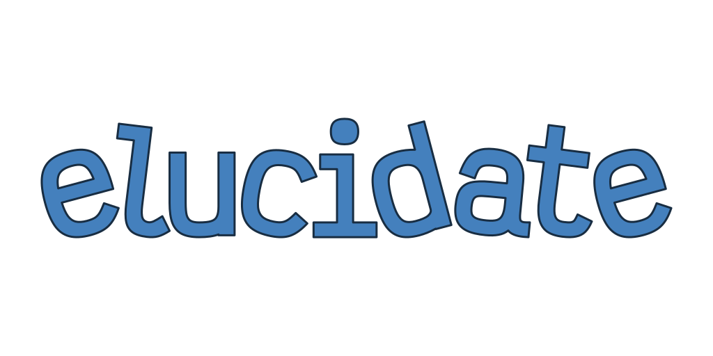

  
  <h3>High-performance JSON parsing for safety-critical systems</h3>
   

The official documentation can be found in the [crate's documentation][docs-rs].

`elucidate` uses a suite of safe, resource-efficient JSON parsing routines to sanitize arbitrary and
untrusted data. It provides an intuitive and easy-to-use API for operating on JSON data without
sacrificing performance.

### JSON Syntax

The specification that defines valid JSON syntax and the format itself can be found
within [IETF RFC 8259][rfc-8259].

For your convenience, we also host a document containing
the [full JSON grammar](/assets/grammar/JSON.md).

## Notable Features

This section contains features that are deemed to be required to produce an MVP. For now, it serves
as a roadmap and a list of features that users can expect to see implemented.

- [ ] Create working parsers that handle valid JSON syntax and data types
    - [ ] Primitive types
        - [X] `boolean`
        - [X] `null`
        - [X] `number`
        - [ ] `string`
    - [ ] Structural types
        - [ ] `array`
        - [ ] `object`
- [ ] Handle nested, structured data such as key-value pairs
- [ ] Transform stringly-typed data into valid data that Rust can understand
- [ ] Built-in adapter API for reading and writing data
    - [ ] Async-compatible `Reader` and `Writer`

## Design Choices

### Language

To satisfy the constraints of `elucidate`, a set of criteria must be met. The language and/or
runtime must be fast, memory-safe and resource-efficient. It must also be able to run on a multitude
of platforms and environments (servers, desktops, embedded/IoT devices and other
resource-constrained devices).

[Rust][rust-lang] fits this niche without having to make significant sacrifices. Conditional
compilation and feature-gating allows users to pick and choose what best suits their particular
use-case. For users that are unsure, reasonable defaults are provided along with feature-sets.

Some additional features that solidified our belief in Rust include a powerful type system (with
algebraic data types!), zero-cost abstractions and powerful pattern matching.

### Parsing Approach

`elucidate` uses a [recursive descent parsing][recursive-descent-wiki] strategy. This is implemented
via [parser combinators][parser-combinator-wiki]. Parser combinators are, in essence, higher-order
functions that are chained together in various ways, producing increasingly complex (and useful!)
parsing functions.

Parser combinators offer a unique degree of flexibility that is particularly suited to parsing JSON.
They provide solutions for handling
minute details and oddities and operate at similar speeds of handwritten
parsers.

Although parsing JSON is relatively simple, it is very difficult to do it _correctly_.
Furthermore, [ambiguities in the official specification][parsing-json-ambiguities] have resulted in
an enormous number of parsers that all handle the format in various ways. This _inconsistency_ means
that users cannot rely on a parser to handle data in the way they expected.

### External Dependencies

External dependencies will be kept to a minimum and feature-gated as necessary to ensure this
library is as flexible as possible.

This project depends on a few well-maintained external crates:

- [nom][nom-repo]

## License

Licensed under the [MIT License](LICENSE):

## Contribution

Unless you explicitly state otherwise, any contribution intentionally submitted
for inclusion in `elucidate` by you, shall be licensed under the MIT License, without any additional
terms or conditions.

See [CONTRIBUTING.md](CONTRIBUTING.md).

<!-- Inline Links -->

[docs-rs]: https://docs.rs/elucidate/latest/elucidate

[nom-repo]: https://github.com/Geal/nom

[parser-combinator-wiki]: https://en.wikipedia.org/wiki/Parser_combinator

[parsing-json-ambiguities]: https://seriot.ch/projects/parsing_json.html#26

[parsing-json-minefield]: https://seriot.ch/projects/parsing_json.html

[recursive-descent-wiki]: https://en.wikipedia.org/wiki/Recursive_descent_parser

[rfc-8259]: https://datatracker.ietf.org/doc/html/rfc8259

[rust-lang]: https://rust-lang.org/
